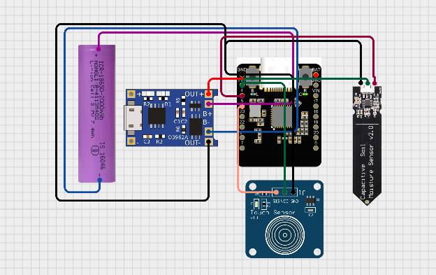
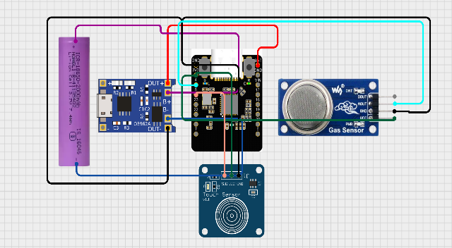
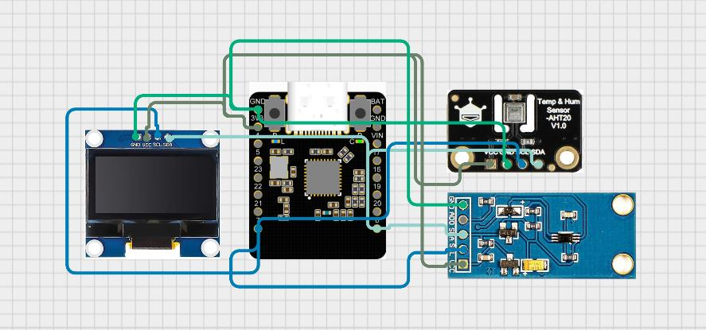
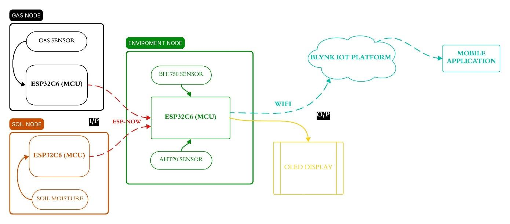
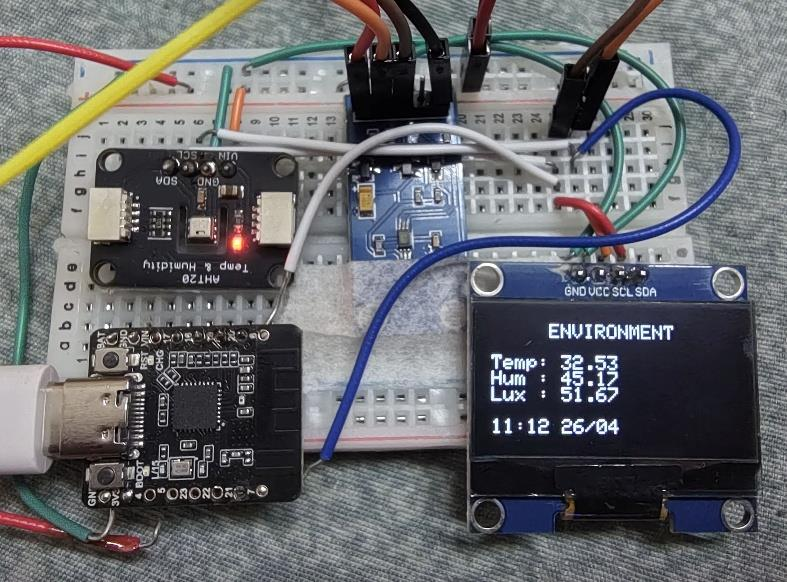
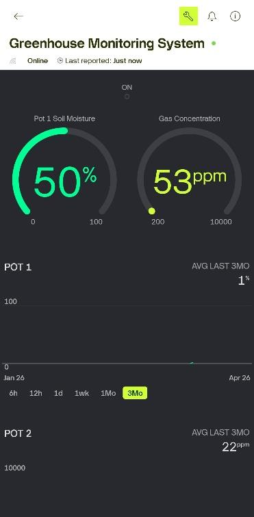
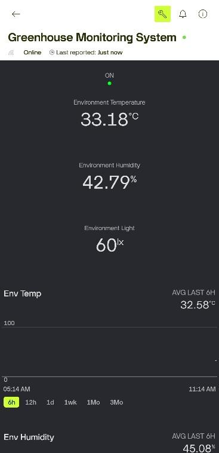

# 🌱 WSN Model for Greenhouse Monitoring

A low-power, scalable **Wireless Sensor Network (WSN)** for smart greenhouse monitoring, using a hybrid **ESP-NOW + WiFi** communication model with real-time cloud visualization via **Blynk IoT**.

📖 **New to this project?** See [SETUP.md](SETUP.md) for full wiring, library, and configuration instructions.

---

## 📖 Overview

Greenhouses require constant monitoring of temperature, humidity, soil moisture, light intensity, and air quality to ensure optimal crop growth. Manual monitoring is slow, error-prone, and inefficient.

This project implements a **low-power WSN-based greenhouse monitoring system** consisting of three node types that communicate locally over **ESP-NOW** and push combined data to the cloud over **WiFi**, enabling both local (OLED) and remote (Blynk app) real-time monitoring.

---

## ✨ Key Features

- 📡 Hybrid communication: **ESP-NOW** (local, low power) + **WiFi** (cloud sync)
- 🔋 **Deep-sleep** power management for battery-operated nodes
- 🌡️ Multi-parameter sensing: soil moisture, gas concentration, temperature, humidity, light intensity
- 📟 Local real-time visualization via **OLED display**
- ☁️ Remote monitoring via the **Blynk IoT** mobile dashboard
- 🧩 Modular, scalable node architecture — easy to add new sensor nodes
- 💰 Cost-effective design suitable for small/medium greenhouses

---

## 🏗️ System Architecture

The system consists of **three nodes**:

| Node | Role | Key Components |
|------|------|-----------------|
| **Soil Node** | Measures soil moisture | ESP32-C6, capacitive/analog soil moisture sensor, 18650 battery, TP4056 charger, capacitive touch switch |
| **Gas Node** | Measures air quality | ESP32-C6, MQ-series gas sensor, 18650 battery, TP4056 charger, capacitive touch switch |
| **Environment Node (Gateway)** | Central hub — collects local + remote data, uploads to cloud | ESP32-C6, AHT20 (temp/humidity), BH1750 (light), OLED display |

**Data Flow:**

[Soil Node] ──┐
├── ESP-NOW ──► [Environment Node] ──── WiFi ────► [Blynk IoT Cloud] ──► [Mobile App]
[Gas Node]  ──┘                      │
└──► [OLED Display] (local view)

---

## 🔧 Hardware Used

- ESP32-C6 Microcontroller (DF-Robot Beetle Mini Dev Board) — ×3
- Capacitive/Analog Soil Moisture Sensor
- MQ-Series Gas Sensor
- AHT20 Temperature & Humidity Sensor
- BH1750 Light Intensity Sensor
- OLED Display (I2C)
- 18650 Li-ion Battery + TP4056 Charging Module
- Capacitive Touch Switches (ON/OFF)

---

## 💻 Software / Platform

- **Arduino IDE** (ESP32-C6 board support)
- **ESP-NOW** protocol for node-to-node communication
- **WiFi** for internet connectivity
- **Blynk IoT Platform** for cloud dashboard and remote monitoring

---

## ⚙️ Communication Methodology

- **ESP-NOW:** Peer-to-peer, router-free communication between sensor nodes and the gateway. Uses structured packets (Node ID + sensor readings), time-slot based transmission to avoid collisions, and built-in acknowledgment handling.
- **WiFi:** Used exclusively by the gateway (Environment Node) to push combined sensor data to the Blynk cloud platform for remote access.

---

## 🔋 Power Management

- Deep-sleep cycle for sensor nodes: **wake → sense → transmit → sleep**
- ESP-NOW minimizes communication overhead and power draw
- WiFi usage restricted to the gateway node only

---

## 🖼️ Circuit Diagrams & Results

**Fig. 1 — Soil Node Circuit Diagram**

**Fig. 2 — Gas Node Circuit Diagram**

**Fig. 3 — Environment Node Circuit Diagram**

**Fig. 4 — System Block Diagram**

**Fig. 5 — Environment Node (Hardware Prototype)**

**Fig. 6 — Blynk IoT Dashboard (Mobile Application)**
 

---

## 📊 Results

- Soil and gas nodes transmitted data reliably via ESP-NOW with no significant packet loss
- Environment node accurately logged temperature, humidity, and light intensity
- Hybrid communication achieved low latency locally and stable cloud sync via Blynk
- OLED and Blynk dashboard together provided seamless local + remote monitoring

---

## 🚀 Future Scope

- Automated control (pumps, sprinklers) based on sensor thresholds
- AI/ML-driven smart irrigation and predictive analytics
- Enhanced mobile app with alerts and notifications
- Solar-powered nodes for extended battery life
- Additional sensors: CO₂, pH, soil nutrients
- Large-scale multi-greenhouse deployment
- Cloud database integration for long-term data logging

---

## ⚠️ Limitations

- Limited ESP-NOW communication range for very large greenhouses
- Requires stable WiFi at the gateway for cloud connectivity
- Battery-powered nodes need periodic charging/replacement
- Basic UI (OLED + Blynk only)
- Monitoring only — no automated control of environmental parameters

---

## 📁 Repository Structure

WSN-Greenhouse-Monitoring/
├── SoilNode/
│   └── SoilNode.ino
├── GasNode/
│   └── GasNode.ino
├── EnvironmentNode/
│   └── EnvironmentNode.ino
├── images/
│   ├── fig1_soil_node_circuit.png
│   ├── fig2_gas_node_circuit.png
│   ├── fig3_environment_node_circuit.jpg
│   ├── fig4_block_diagram.jpg
│   ├── fig5_environment_node_photo.jpg
│   ├── fig6_blynk_dashboard_1.jpg
│   └── fig6_blynk_dashboard_2.jpg
├── Docs/
│   └── PBL_Report.pdf
├── LICENSE
├── README.md
└── SETUP.md

---

## 👤 Author

**Vikash Kumar**
GitHub: [@itvikash](https://github.com/itvikash)

---

## 📄 License

This project is licensed under the MIT License — feel free to use and modify it for educational purposes.
